# Power BI basics

## At the end of this lesson you will learn

- Import data from web, databases and Excel files
- Power BI interface
- Data Tab, Relationship Tab and Report Tab
- Visualization and Fields menu


## Import data from Web

Here we import data from this [movies](http://www.boxofficemojo.com/alltime/world/) website

Click on Get data>from Web and paste the web url 

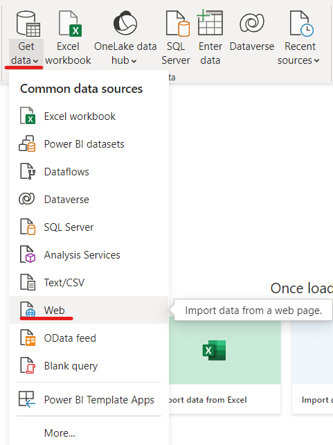


As well as in Excel we count on Power Query, case we want to alter any table or column. However we don't want to change anything right now. We click on Load and Close

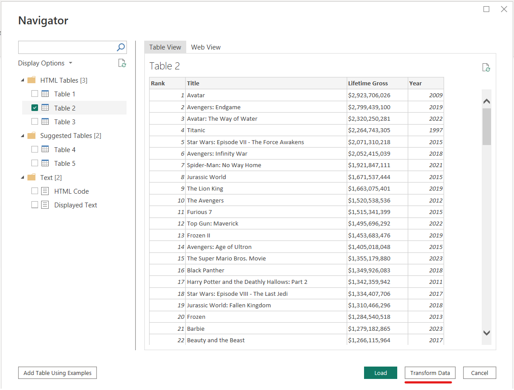


## Power BI interface: Data Tab, Relationship Tab and Report Tab

Power BI interface is divided into 3 main panels, each one with very differentiated functionalities

### Data Tab

The Data tab is primarily focused on data preparation and transformation. When you open Power BI Desktop, you start in the Data view. 

In this tab, you can:

- Connect to various data sources such as databases, Excel files, web services, etc.
- Use the Power Query Editor to transform, filter, and shape your data before it's loaded into Power BI.
- Create calculated columns and measures using DAX (Data Analysis Expressions) to enrich your data model.
- Manage queries and data sources.
- Apply data loading options and transformations.

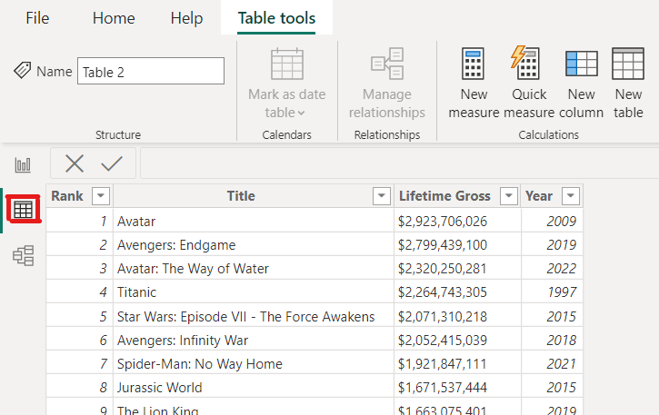


### Relationship Tab (Model Tab)

The Relationship tab is where you establish relationships between tables in your data model. In this tab, you can:

- Define relationships between tables by specifying the related fields.
- Manage and edit existing relationships.
- Set cross-filtering behavior to control how filters applied to one table affect related tables.
- Ensure data integrity by creating relationships that reflect the real-world connections in your data.

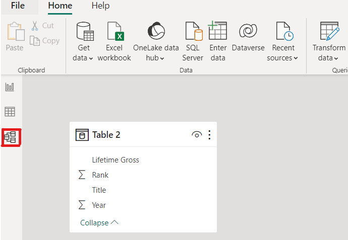

### Report Tab

The Report tab is where you design and create visual reports using the data model you've built. In this tab, you can:

- Add visuals (charts, tables, maps, etc.) to the canvas to represent your data.
- Format visuals, including adjusting colors, fonts, and labels.
- Add interactivity using filters, slicers, and drill-through actions.
- Organize visuals on pages to create meaningful dashboards.
- Customize the report's appearance using themes.

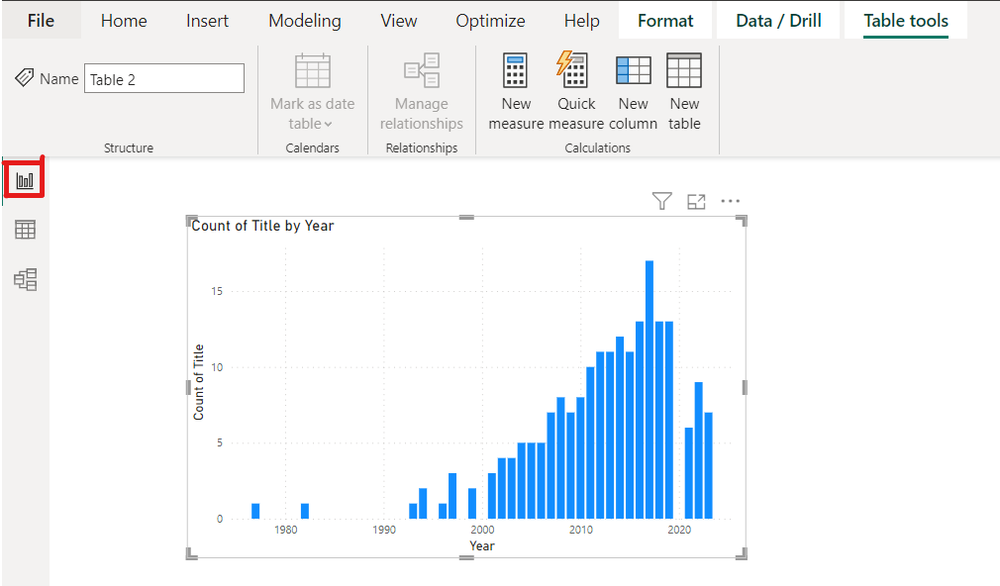

## Import data from database

As well as with Excel we can gather data from a database. We will import Publications database using ODBC connector

On the Home ribbon click on Get data>more. Search ODBC and click on it

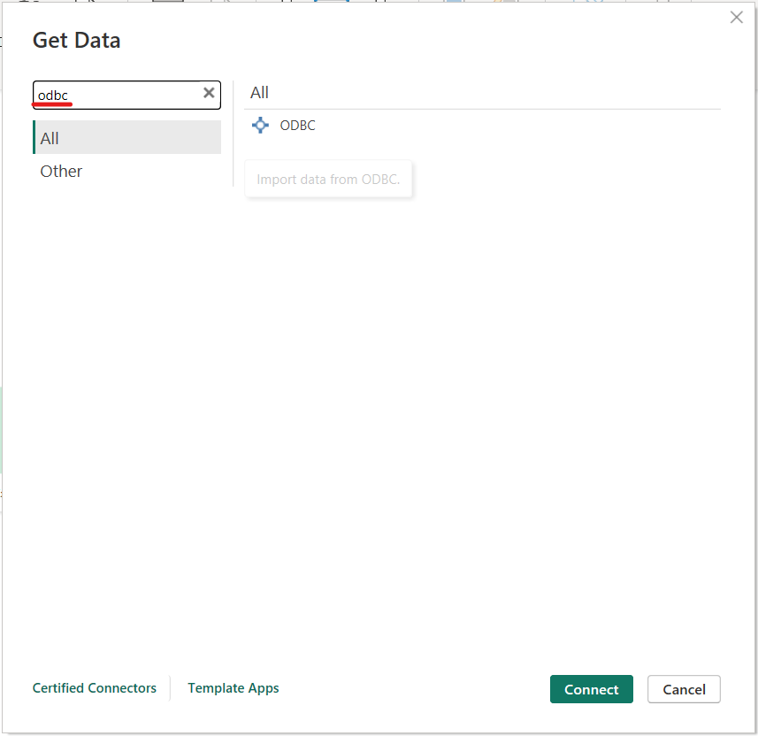

As we configure it for excel, the connection should be already prepared, we click on EY database. So we will have access to every database we worked on in the SQL chapter

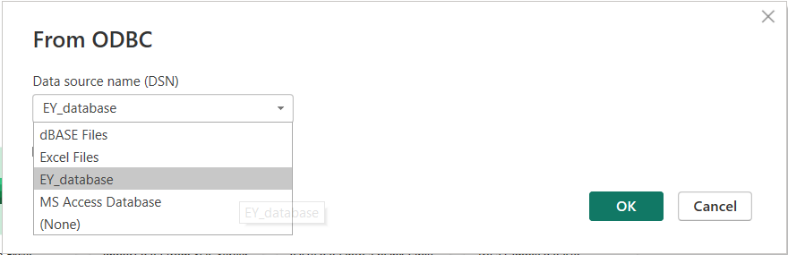


We select the tables we want to import from the publications database, and we Load

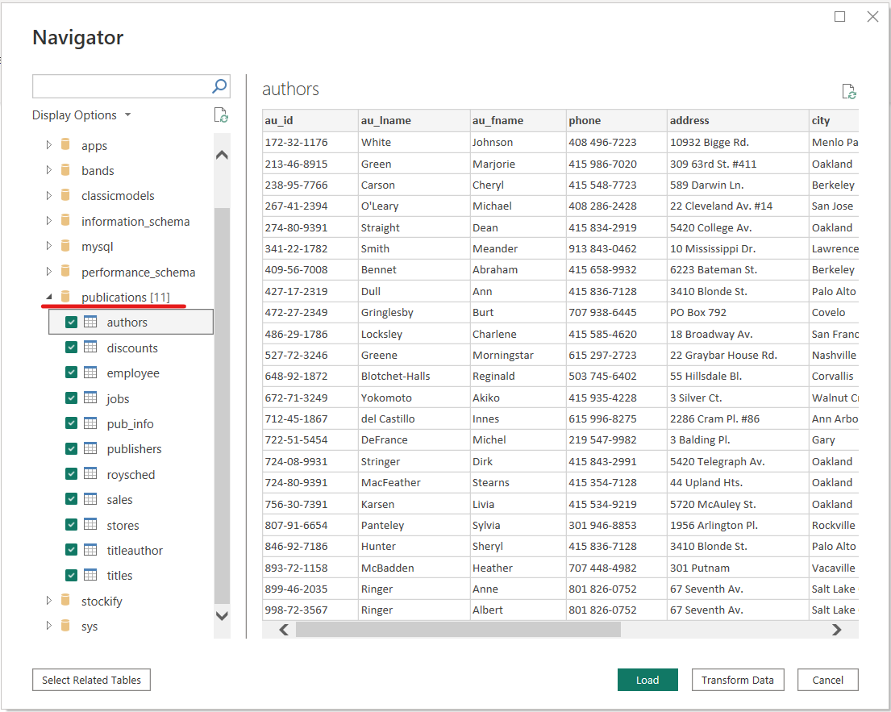

Now, in the Relationship Tab we have the entity-Relational Model, similarly to MySQL


In the Data Tab we can navigate table-by-table and through the columns

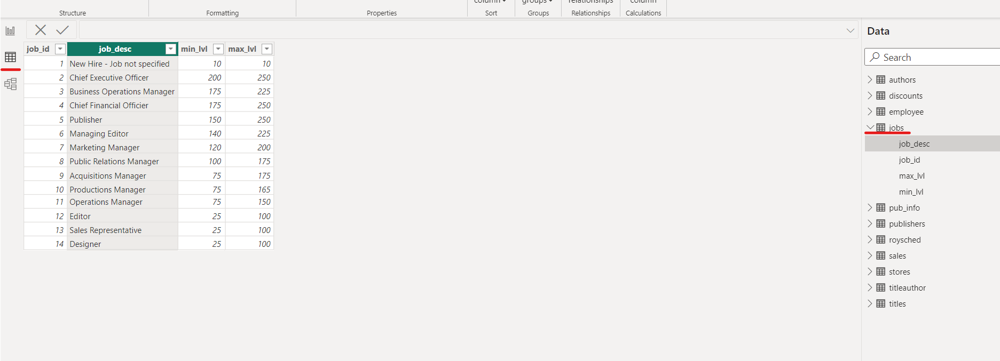

Finally, in the Report Tab, we see the visualizations. Note that state info comes from the store table, and the count of orders comes from the sales table. The connection is already done, we jsut need to drag and drop the variables in the x-axis and in the y-axis. Later we will specify with more detail.

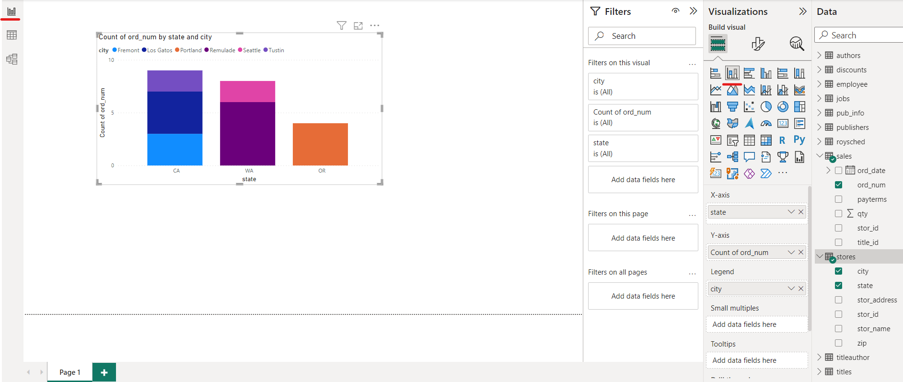


If we see in the right part of the screenshot, there are 3 menus: Filters, Visualizations and Data

In visualizations we select the type of chart or table we want to display. Also we insert the data we want to analyze dropping the columns from the data menu to the x-axis, y-axis, legend...

Another functionality Power BI has is filtering by clicking in the chart. From the menu Filters we parametrize these filters, for example if we want to they apply to the current page or to every page in the dashboard

## Import from Excel

Click on Home>Excel Workbook and select the excel file Factures.xlsx, which contains 5 sheets with different tables. In the Importing menu (Navigator) select the 5 tables and Load

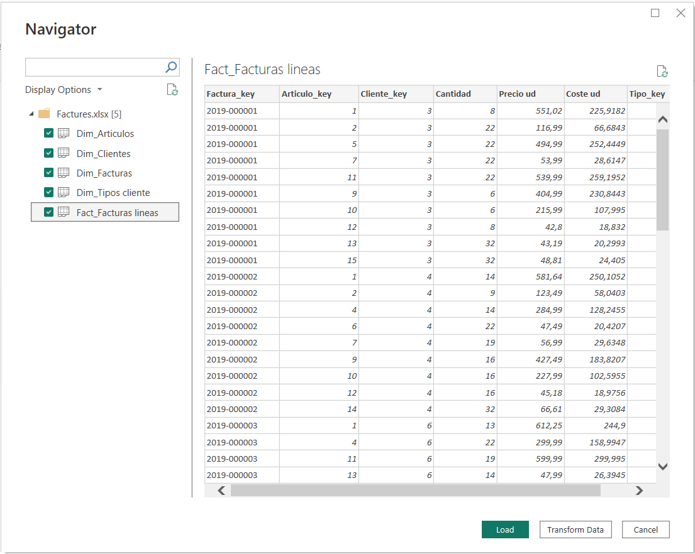

In the model Tab we can see that they are correctly loaded.

As in SQL, there are several types of relationships between tables (1 to 1, 1 to many...). If we right-click in one of the auto-generated connections and then in properties, we can navigate and analyze the different options.

Just for testing, delete the relationship between Dim_articulos and Fact_facturas lineas. Then we drag and drop the Articulos_key column from dim_articulos into Fact_Facturas Lineas. This is how we create a relationship between two tables.

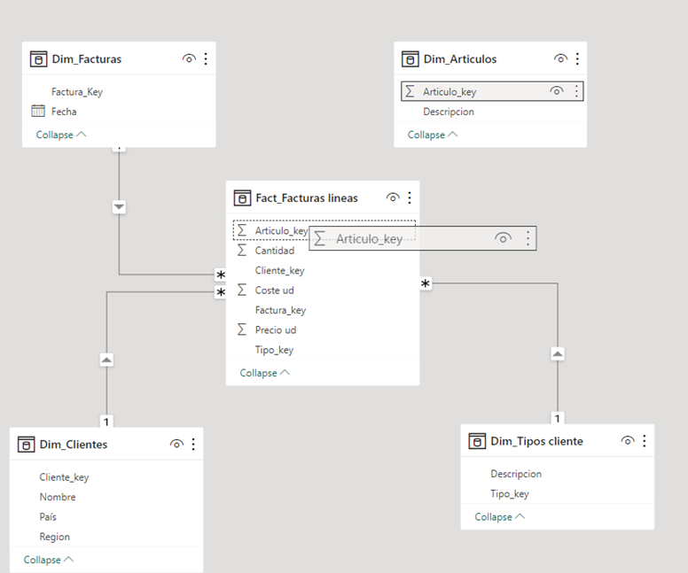


## Import from MySQL

First of all, you need to install the [Oracle MySQL Connector/NET](https://dev.mysql.com/downloads/connector/net/) package before using this connector in Power BI Desktop. For Power Query Online (dataflows) or Power BI service, if your MySQL server isn't cloud accessible and an on-premises data gateway is needed, the component Oracle MySQL Connector/NET must also be correctly installed on the machine running the on-premises data gateway. To determine if the package is installed correctly, open a PowerShell window and run the following command:

```bash
[System.Data.Common.DbProviderFactories]::GetFactoryClasses()|ogv
```

If the package is installed correctly, the MySQL Data Provider is displayed in the resulting dialog. For example:


### Connect to MySQL database from Power Query Desktop
To make the connection, take the following steps:

 - Select the MySQL database option in the connector selection. Home > Get Data > More... and search for "MySQL Database"

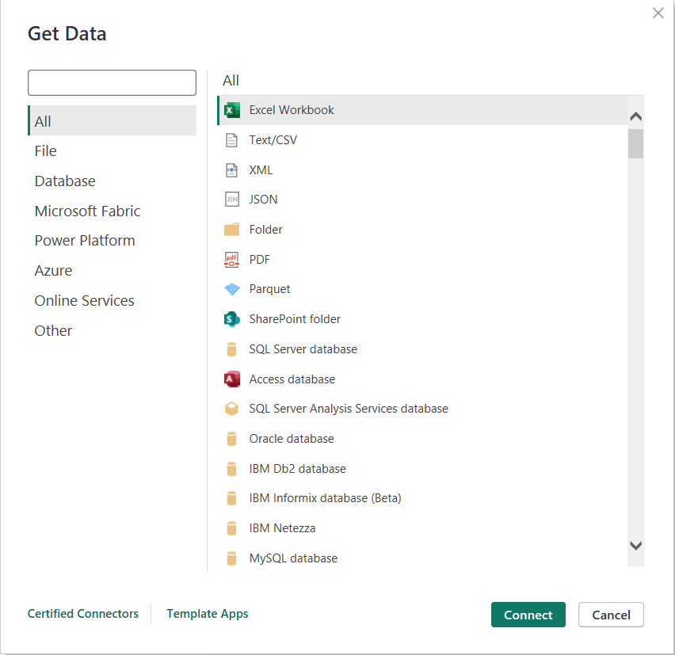

 - In the MySQL database dialog, provide the name of the server and database. 

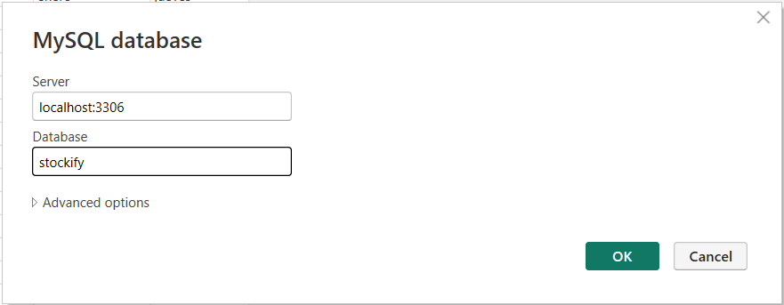

 - Probably it ask you to enter your MySQL credentials (In the third box introduce your server "localhost")


 - select the tables we want to connect
 
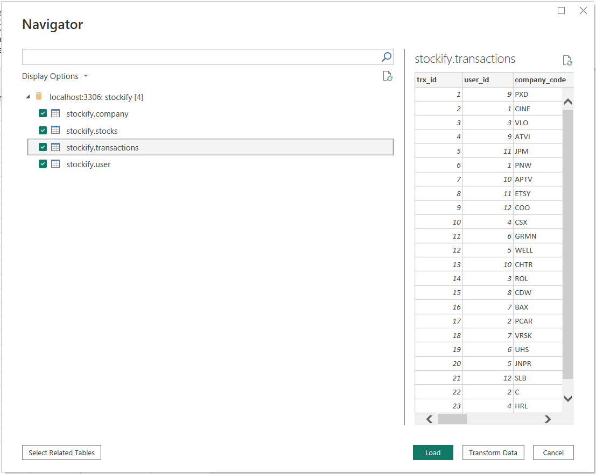

 - Finally you'll get the next loading message
 
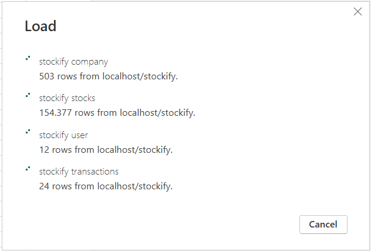


