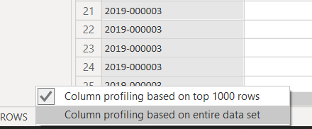
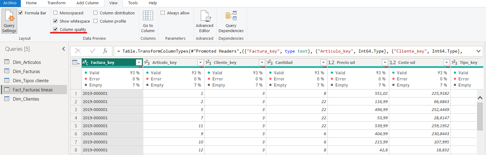
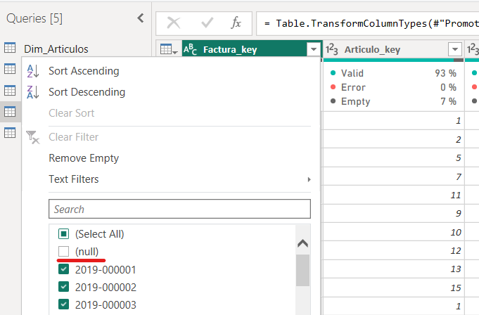
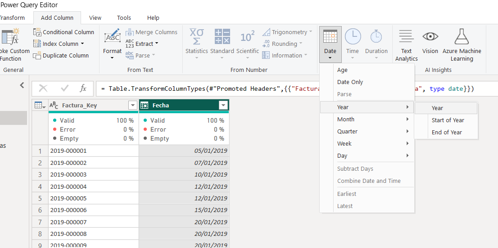
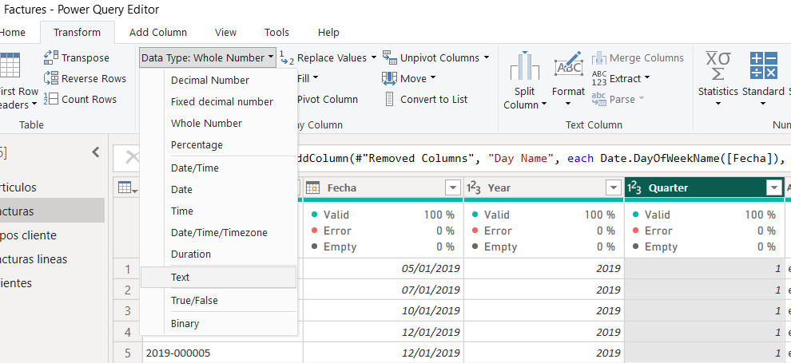
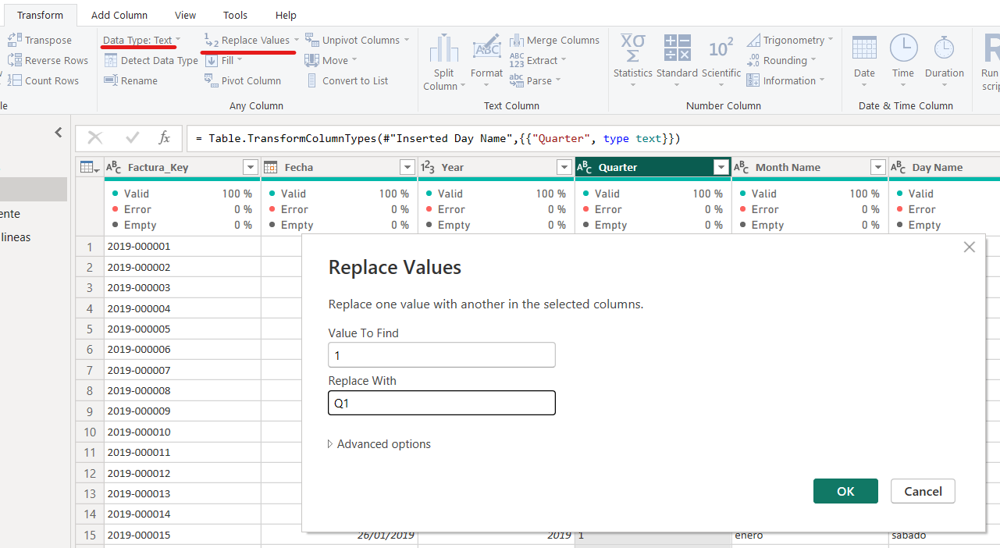
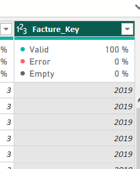

# Power Query with Factures Data

Power Query in Power BI is a data transformation tool that enables users to connect to various data sources, clean, reshape, and merge data, and create a refined dataset. 
It is a user-friendly interface for preparing data before analysis, ensuring accuracy and consistency in insights and reports.

After having imported the data, we click in Home>Transform data, and PowerQuery is opened.

## Factures Data

The next lessons will use Factures Data, if you want to follow the instructions at the time of the teacher open a new PowerBI file, import Facture Data and **Listen to your teacher!!**

Anyway, the final PowerBI file with every step completed is available for you

## Validating data

Firstly, let's say to Power BI that we want to make changes to every row, not only to the first 1000. We do this by clicking in the left-bottom 

Secondly, we activate the Column quality assistant in the View menu. It informs about the empty and error data. As we see we have some empty data. Let's fix it! 

Just filtering and dropping null values

Check every table and confirm that there is no more missing values!

## Creating new columns from existing ones

Now, we create new date columns such as year, month, quarter... in the table Dim_facturas. Select the column "Fecha", then click in Add Column>Date>Year, and a new column will be created. 
Repeat the process to create the rest of the date columns

## Replace values

Here, we replace the values of the column Quarter to Q1,Q2... Firstly we need to change the format of the columns, from integer to text, if we don't we have an error

Next, we replace values from the Transform Tab, like in the image. Repeat the process for values 2,3 and 4

## Custom column

Power Query also allows to custom columns, one example is by concatenating two columns, for example we create a Country-Region column in Dim_client table. In menu Add Column, click on Custom Column and follow the
image instructions.

## Mini exercise!!

Do you remember how to split a column in Power Query? We saw it in the Excel chapter and the elections data. Now, create a new column taking only the year from the Facture_key from Fact_Factures lines. 
Call it Facture_year (Do not remove the Facture_key columns!!!). Hint: Use split column

## Conclusion

As you can see Power Query has lots of functionalities, take your time to know every action you can carry out. Play with Power Query!!

**DO NOT FORGET TO CLICK ON LOAD AND CLOSE BUTTON IN HOME MENU!!!**

