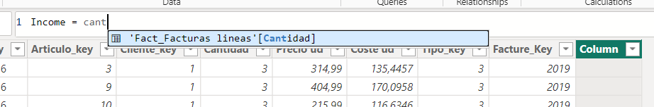
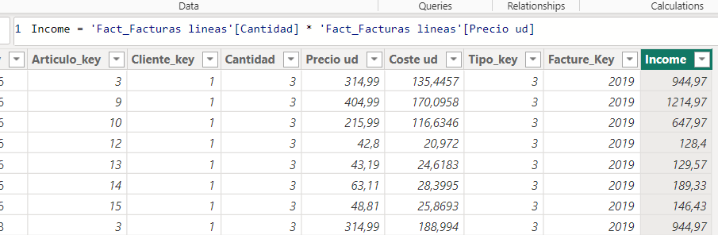
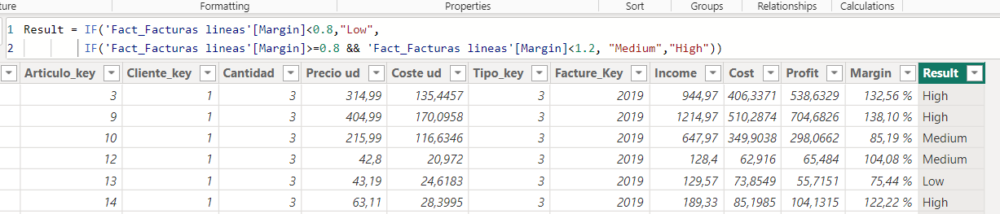
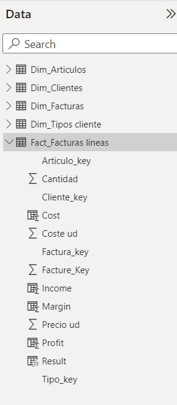

# Creating new columns with DAX and Factures Data

DAX (Data Analysis Expressions) is a formula language used in Power BI, Excel, and other Microsoft tools. It enables users to create custom calculations, measures, and calculated columns in data models. 
DAX enhances data analysis by performing advanced calculations, aggregations, and logic on relational data.

## Calculated columns

Similarly to Excel, we can input formulas and make mathematical operations between columns, so, let's create income, cost... and some other calculated columns variables

Go to Table Tab and click on Fact_Factures lines table, it is here where we will create the new columns. In Home ribbon click on Create new column. The formula bar will be activated, where we input the formulas

The new column Income will be the product between "Cantidad" (Quantity) and "Precio ud" (Unit price), so, Type in the Formula bar the name of the new column "Income" and the operation

Income = cant...  PowerBI will suggest some possible columns we probably want to use

End the formula calculation

Repeat the process by calculating the cost, profit (income - cost), Margin (Profit divided by cost) fix it as percentages with 2 decimals (column tool menu), 

Finally, create Result which indicates low, medium or high depending if Margin is lower than 0.8, or higher than 1.2

We can also see our new variables in the right-data menu

