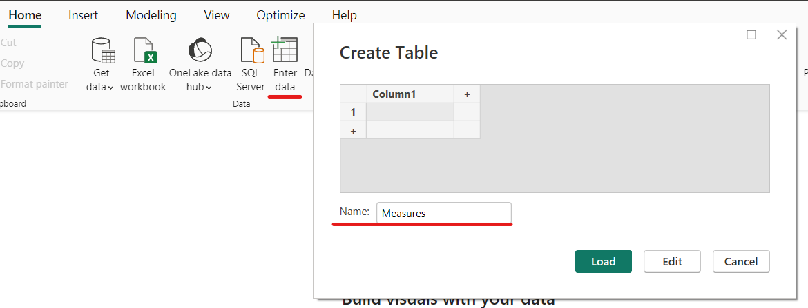
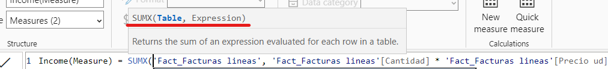
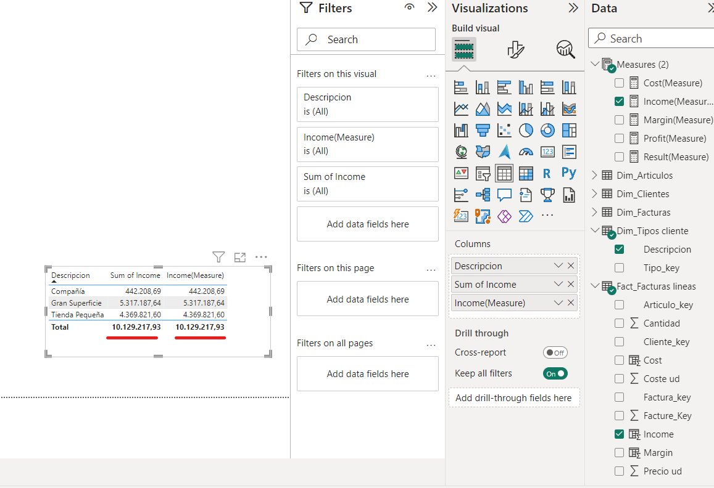

# Creating measures with DAX and Factures Data

## Similarities and differences between New columns and Measures

In DAX (Data Analysis Expressions), new columns and measures serve distinct roles:

New Columns:

- **Calculation Scope:** New columns are calculated for each row in a table during data loading and model refresh.
- **Storage:** They consume memory as they add new data columns to the table, which can impact the model's size.
- **Usage:** New columns are typically used to add calculated fields to a table, such as transformations, concatenations, or computed values.
- **Aggregation:** New columns are not suitable for aggregations or calculations across different groups or levels of data.

Measures:

- **Calculation Scope:** Measures are dynamic calculations performed on aggregated data in visualizations, adapting to user interactions and filters.
- **Storage:** They consume **minimal memory** as they don't create new columns in tables but rather compute results on-the-fly.
- **Usage:** Measures are primarily used in creating interactive reports and dashboards to calculate values like sums, averages, or ratios.
- **Aggregation:** Measures are designed for aggregations and work across different groups or levels of data, providing insights based on summarized or filtered values.

In summary, new columns are used to extend tables with static calculated values, while measures are used for dynamic calculations on aggregated data in visualizations, allowing for interactive analysis in tools like Power BI.

## Create measures

First of all, measures are created in a new table, so let's create it. Click on Home>Enter Data, and give a name to the new table ("Measures"):



Now, we define the new measures. We will create the same measures as new columns in the last chapter. 
Later, in our visualizations, we will use them preferable to the new columns, due to their lower computational costs when calculating aggregations.

We won't use SUM function but SUMX, which includes two fields: a Table and an Expression



```
Income(Measure) = SUMX('Fact_Facturas lineas', 'Fact_Facturas lineas'[Cantidad] * 'Fact_Facturas lineas'[Precio ud])
```
```
Cost(Measure) = SUMX('Fact_Facturas lineas', 'Fact_Facturas lineas'[Coste ud] * 'Fact_Facturas lineas'[Cantidad])
```
```
Profit(Measure) = [Income(Measure)] - [Cost(Measure)]
```
```
Margin(Measure) = [Profit(Measure)] / [Cost(Measure)]
```
```
Result(Measure) = IF([Profit(Measure)]<0.8,"Low",
                  IF([Profit(Measure)]>=0.8 && [Profit(Measure)]<1.2,"Medium","High"))
```

We check that both ways return the same results, although Measures are faster



Now, as Measures are computationally better, we delete the columns created in the last chapter, because when we will create visualization we will use measures.

## When DAX new columns are usefull?

For example when we create new Date columns. Similarly to those created with Power Query in the second lesson of PowerBI chapter

## Mini exercise!!!

Create using DAX new columns: Year, month, Quarter and day. Try it! it is very easy!


