# Designing a Dashboard

A Power BI dashboard is a visual canvas that displays a collection of interactive data visualizations, reports, and key performance indicators (KPIs) from various data sources. 
It provides a consolidated view of important information, enabling users to monitor trends, track metrics, and gain insights at a glance. 
Power BI dashboards allow for interactivity, filtering, and drilling down into specific data points, making it a powerful tool for data-driven decision-making and communication within an organization.

## At the end of this lesson you will learn

 - Format page
 - Designing visualizations: Tables and Charts, and more
 - Apply filters
 - Markers

## Format page

In the visualization panel click on Format Report Page

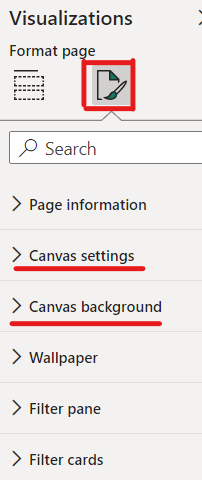

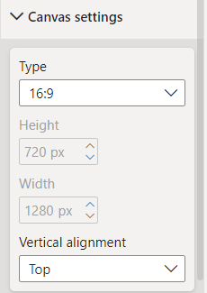  

There are multiple option to set up. We will focus on Canvas settings and Canvas background

In canvas settings we input the 16:9 size because is the biggest, and we will need space. We also paint the background on blue (choose your favourite colour)

## Design visualizations

The goal of this lesson is to follow the indications of the teacher and the student replicate at the same time, boosting its creativity

### Titles

Add a text box and input a title to your report. You can also add an image.

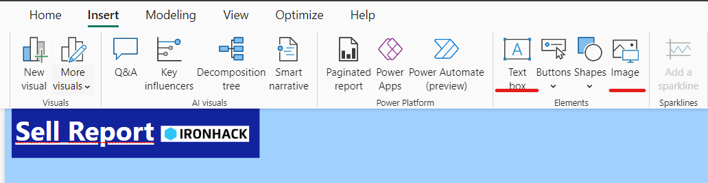

### Cards

In Power BI, cards are visual elements used to display single numerical values or key performance indicators (KPIs) prominently within a report or dashboard. 
A card visual can show a specific metric, total, count, or percentage, allowing users to quickly grasp important insights without the need for extensive analysis. Cards are often used to highlight critical data points and provide an at-a-glance summary of key business metrics. They can be customized in terms of formatting, font, color, and more to match the overall design of the report or dashboard.

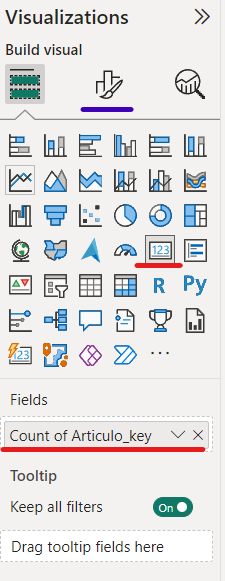

### Line chart

In Power BI, a line chart is a type of data visualization that represents data points as connected line segments, illustrating trends and changes over time or any continuous axis. Line charts are particularly useful for visualizing data with a temporal component or for showing relationships between variables. They can display multiple lines on a single chart, making it easy to compare trends and patterns. Line charts in Power BI offer various customization options, including axis scaling, color choices, and tooltips, enhancing their ability to communicate insights effectively.

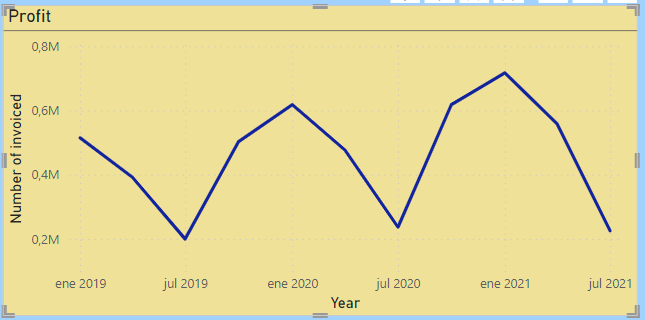

**Format your visualization**

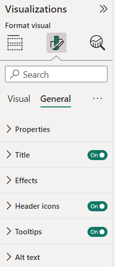

We can format our visualiaztions from a General or Visual perspectives. General is rather for titles, char backgrounds and some other effects. While visuals allow us to parametrize the lines and the axis. **This formatting is available for any visualization type**

### Bar chart

In Power BI, a bar chart is a type of data visualization that presents data using rectangular bars. Each bar's length represents the value of a specific category or variable, allowing for easy comparison between different items. Bar charts are especially effective for visualizing categorical data and showing measures (average, median, variance) or frequencies. They can be displayed horizontally (horizontal bar chart) or vertically (vertical bar chart) and can be customized in terms of color, labeling, and formatting to convey insights clearly. Power BI provides a range of options to create and customize bar charts for effective data communication.

There are two types of "complex" bar charts: Stacked and clustered (When insert a categorical variable for comparison)

 - **Stacked:** bars are accumulated on top of each other to show the cumulative total of multiple variables within each category on the x-axis.

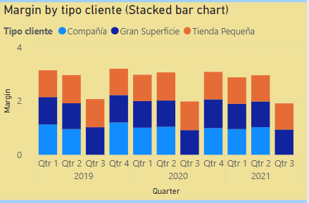

 - **Clustered:** bars representing different categories or variables are grouped side by side within each category on the x-axis.

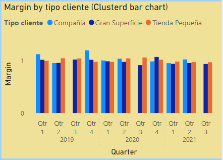

**Do you understand the difference? Why the bars in stacked chart are higher than in clustered??**

### Line and Bar combined elements chart

Very useful chart for easy comparisons between metrics. In this case we input a new measure (count of invoices)

### Mini exercise!!

Deploy a Line chart with two lines, representing profit and another measure, like income, in a different axis

### Pie plot

A pie plot, is a circular data visualization that represents data as slices of a pie, where each slice corresponds to a category or variable. The size of each slice is proportional to the value it represents within the whole dataset. Pie plots are primarily used to show the distribution of categorical data or to highlight the proportion of different parts relative to the whole. They are suitable for displaying percentages or fractions and are most effective when visualizing a small number of categories with distinct differences in values. However, pie plots can become less effective when dealing with too many categories or when it's challenging to accurately compare the sizes of slices.

Notice that the novelty here is that Legend is in Bold, figure out how to do it!!

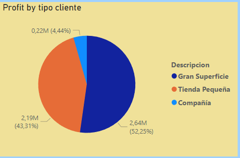
 
### Scatter plot

A scatter plot, is a data visualization that displays individual data points as dots on a two-dimensional plane. Each dot represents a unique data entry with values on both the x-axis and y-axis. Scatter plots are used to visualize relationships between two continuous variables, allowing you to observe patterns, trends, and correlations in the data. They are useful for identifying clusters, outliers, and the overall distribution of data points. Scatter plots can help determine whether there's a linear or nonlinear relationship between variables and whether changes in one variable are associated with changes in the other.

**Add a trendline like in the example!!**

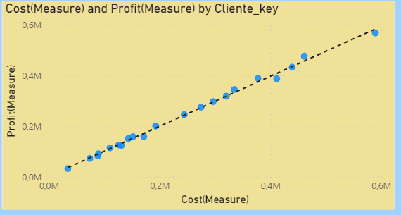

### Treemap 

A treemap is a data visualization in which hierarchical data is represented as nested rectangles within a larger rectangular space. Each rectangle, or "tile," represents a specific category or subcategory, with the size of the tile corresponding to a quantitative value. Treemaps are particularly useful for visualizing hierarchical and nested data structures while conveying both the distribution and relative proportions of values. They are effective in displaying the relationship between parent and child categories, making them a valuable tool for exploring data with multiple levels of hierarchy. Treemaps can be customized in terms of colors and labeling to enhance clarity and insight communication.

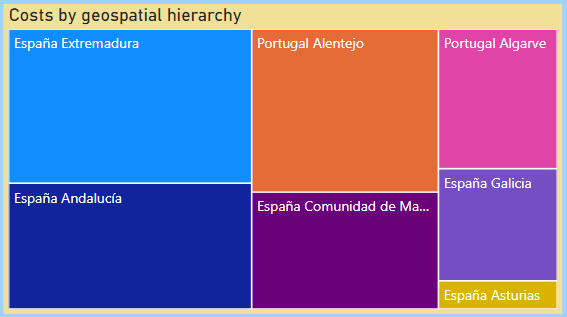

### Map

A map is a data visualization that displays geographical information using geographic features like points, lines, and polygons on a geographical background. In Power BI, maps allow you to visualize location-based data and analyze spatial relationships. You can plot data points on a map, create custom regions, and use colors and symbols to represent different attributes. Maps are particularly useful for displaying data related to locations, such as sales by region, customer distribution, or any other data with a geographic component. Power BI provides interactive map visuals that allow users to zoom, pan, and explore the data in a spatial context.

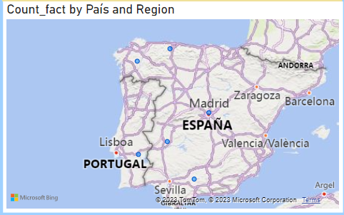

### Tabular visualizations: Tables and Matrices

Matrix Visual:

- The matrix visual allows you to group and aggregate data based on row and column hierarchies.
- It supports drill-down and expansion of hierarchies, providing a way to explore data at different levels of granularity.
- The matrix visual can have multiple levels of rows and columns, making it suitable for displaying multidimensional data.
- It's often used to create pivot-style reports where data can be summarized and expanded dynamically.

Table Visual:

- The table visual presents data without grouping or aggregation. It displays individual data rows without any hierarchy.
- Unlike the matrix, the table visual does not support drill-down or hierarchical expansion.
- The table visual is ideal for displaying raw data, and it's commonly used when you want to present a simple list of records.
- It's well-suited for situations where detailed data is more important than summarization.

In summary, the matrix visual is used for presenting aggregated data with drill-down capabilities, while the table visual is used for displaying raw data without hierarchical structure. 
The choice between them depends on the specific data presentation requirements and the level of granularity you want to convey to your audience.

**Matrix**
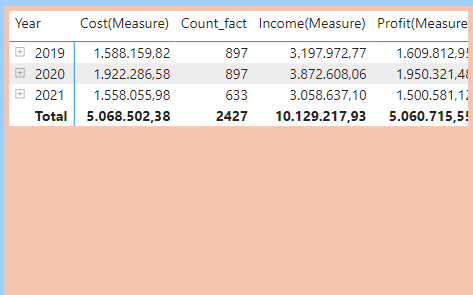

**Table**
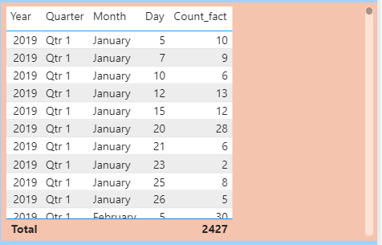

## Filters 

As you probably realized, when you click on a visualization, we are selecting a piece of data, and that selection affects to every other visualization in the same page. 

However, filters go further, we can set up filters on three levels of impact:

Visual-Level Filters:

- Applied directly to a single visual.
- Control what data is shown in that specific visual only.
- Useful for isolating specific aspects of data within a single visual.

Page-Level Filters:

- Applied to an entire report page.
- Control what data is displayed across all visuals on that page.
- Allow you to create consistent data views within a page.

Report-Level Filters:

- Applied to the entire report.
- Affect all visuals and pages in the report.
- Useful for creating high-level filters that impact the entire report.

Filters can be parametrized through the Filter menu

On the right menu Filters, we parametrize them

If we want to apply a filter on a visualization, we must click on one first. Then it appears all the fields that take part in the chart building, like in Excel we can Filter! At the bottom we can also "Add data fields here" using external variables too. In the example below, we create a filter using Tipo cliente Descripcion = "Gran superficie"

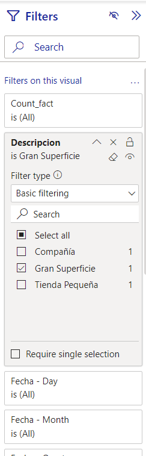

Filter can be hide, locked, clear and remove

### Mini exercise!!

Apply a filter the same filter  (Tipo cliente Descripcion = "Gran superficie") for the entire page and filter for the year 2019 for the entire report

### Bookmarks

In Power BI, a bookmark is a feature that allows you to capture the current state of a report, including the visibility, filters, and selection of visuals. Bookmarks essentially save a snapshot of the report's layout and interactivity settings at a specific moment. This allows users to revisit and share specific views of the report without losing the arrangement or the applied filters.

Bookmarks are especially useful for creating presentations, storyboards, or interactive dashboards with predefined views. You can create multiple bookmarks representing different perspectives of the data and toggle between them to showcase various insights. Additionally, you can add bookmarks to buttons or navigation elements to enable users to switch between different views easily.

#### How to create a Bookmark

As a bookmark is used to return to some specific point, the first thing we have to do is to apply the necessary filters and drills for the desired state.

Then Click in View>Bookmarks to open a menu

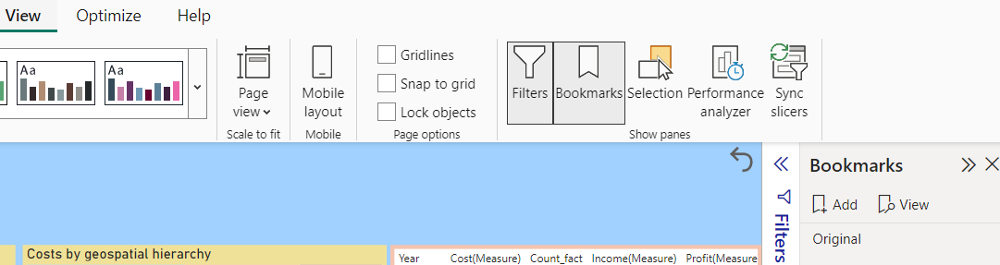

- Add a new bookmark and give it a name. We call it "Compañia-Majadahonda" because we want to filter by tipo cliente compañia and cliente city Majadahonda
- Then Insert Tab>button and select this symbol  
- In format menu opened at the right part of the screen we can configure style and other settings. We are now interested in Action menu. Click on it
- Activate it (ON) and select Bookmark in Type drop-down. Then a new cell appears, select the book mark you created ("compañia-Majadahonda")
- Now, click on some visualization randomnly. Then to go back to "tipo cliente compañia and cliente city Majadahonda" type Ctrl+ click on the bookmark you created  

## Mini exercise

Create a bookmark that go back to the original situation, without filters nor drill downs.

